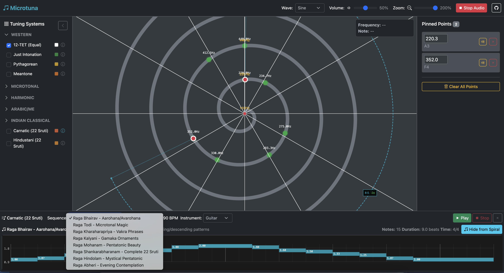

# Microtuna - Music Scale Explorer

**[🎵 Try the Live App](https://ptrthomas.github.io/microtuna)**

A web-based logarithmic spiral frequency visualizer that allows users to explore harmonic relationships between musical frequencies through an interactive interface. Features real-time audio synthesis, multiple tuning system overlays, and an intelligent arpeggiator for exploring scales.

## Features

- **Interactive Spiral Visualization**: Logarithmic spiral representing the continuous frequency spectrum
- **Multiple Tuning Systems**: Explore 12-TET, Just Intonation, Pythagorean, Arabic, Turkish, Persian, and microtonal systems
- **Real-time Audio Synthesis**: Polyphonic Web Audio implementation with multiple waveforms
- **Intelligent Arpeggiator**: Scale-aware sequencer with authentic cultural musical sequences
- **Harmonic Analysis**: Visual representation of frequency ratios and cents deviation
- **Professional Interface**: DAW-inspired design with responsive controls

## Quick Start

1. Clone or download the repository
2. Open `index.html` in a modern web browser
3. Click on the spiral to pin frequency points and hear them play
4. Toggle different tuning systems to see how they overlay on the spiral
5. Explore the arpeggiator to hear authentic scales from various musical traditions

## How to Use

### Basic Interaction
- **Hover** over the spiral to see frequency and note information
- **Click** on the spiral to pin points and start audio playback
- **Toggle tuning systems** in the right panel to see different musical scales
- **Adjust volume and waveform** in the header controls

### Arpeggiator
- Click the 💿 icon next to any tuning system to explore its scales
- Use the piano roll interface to select and play notes
- Choose different instruments (guitar, piano, bell) and tempos
- Experience authentic musical sequences from various world traditions

### Harmonic Analysis
- Pin multiple points to see harmonic relationship arcs
- Ratio labels show simple fractions and cents deviation
- Color coding indicates harmonic accuracy

## Tuning Systems Included

### Western Systems
- **12-TET (Equal Temperament)**: Standard Western tuning
- **Just Intonation**: Pure harmonic ratios
- **Pythagorean**: Perfect fifths-based tuning
- **Meantone**: Historical European temperament

### Microtonal Systems
- **19-TET, 31-TET, 53-TET**: Equal divisions exploring microtones

### World Music Systems
- **Arabic 24-Quarter**: Middle Eastern maqam system
- **Turkish Makam**: Ottoman classical music scales
- **Persian Dastgah**: Persian classical music modes
- **Carnatic & Hindustani**: Indian classical music systems

### Natural Systems
- **Harmonic Series**: Natural overtone progressions

## Technical Details

- **No build process required**: Pure HTML, CSS, and JavaScript
- **Modern Web Audio API**: Polyphonic synthesis with ADSR envelopes
- **Canvas-based visualization**: High-performance 2D graphics
- **Bootstrap 5**: Responsive dark theme interface
- **Mathematical precision**: Accurate frequency calculations and harmonic analysis

## Browser Requirements

- Modern browser with Web Audio API support (Chrome, Firefox, Safari, Edge)
- Canvas 2D support
- ES6+ JavaScript support

## Files

- `index.html` - Main application structure
- `main.js` - Core application logic and audio engine
- `main.css` - Custom styling and responsive design
- `arps.js` - Musical sequences and arpeggiator functionality
- `spec.md` - Detailed technical specification

## For Developers and AI Recreation

The `spec.md` file contains a comprehensive technical specification that provides complete implementation details for recreating Microtuna from scratch. This specification is designed to be detailed enough for:

- **Developers** wanting to understand the architecture and implementation details
- **LLM/AI assistance** for recreating or extending the application
- **Educational purposes** to learn about music theory, Web Audio API, and canvas visualization
- **Contributing** new features or tuning systems

The spec includes mathematical formulations, code examples, UI/UX guidelines, and implementation strategies for all features including the planned pitch-bend system for authentic world music ornaments.

## Contributing

This is an educational and artistic project exploring the mathematics of music and the diversity of world tuning systems. Contributions welcome for:

- Additional tuning systems and musical scales
- **Exotic microtonal systems**: If you know of unique tuning systems from any musical tradition, please suggest them or contribute implementations
- **Traditional melodies**: Authentic sequences from world music traditions not yet represented
- **Pitch-bend and microtonal ornaments** (gamakas, maqam inflections, tahrir)
- **Cross-system melody mapping** for tuning system comparison
- Audio synthesis improvements
- UI/UX enhancements
- Educational content and documentation

We're particularly interested in:
- **Regional variations** of existing systems (e.g., different maqam tunings, regional Indian ragas)
- **Historical temperaments** and ancient tuning systems
- **Contemporary microtonal compositions** and experimental scales
- **Folk traditions** with unique intervallic structures

## Planned Features

- **Pitch-Bend System**: Continuous pitch variation with mouse gestures for authentic world music ornaments
- **Arpeggiator Sequence Styles**: Play sequences in different orders (ascending, descending, up-down patterns, random)
- **Cross-Tuning Mapping**: Map melodies between different tuning systems to hear and compare differences
- **Cultural Ornaments**: Authentic gamakas (Indian), maqam inflections (Arabic/Turkish), and tahrir (Persian)
- **Gesture Recording**: Save and replay pitch-bend sequences

## License

Open source - feel free to use, modify, and share for educational and artistic purposes.
